# Using repo-creatooor in your organization

## Preconditions

- GitHub Teams: a necessary condition since branch protection rules, one of the most important features for this tool to enforce, are not available on private repositories without it, and this tool creates private repositories. This is the cheaper of the two available paid plans for an organization (the other being Enterprise, which is not necessary).
- A team within your organization called `all`, including all of your organization's members. This is necessary to make private repos accessible by default to all organization members.

## Steps

To start, fork this repository into your organization.
After this, you'll have to configure a GitHub App and configure it so the workflows defined in this repository can perform the required administrative actions in your organization.
As a final step, you'll configure the secrets for the workflows so they can execute as the GitHub App.

### Creating the GitHub App

Please refer to the [official documentation](https://docs.github.com/en/apps/creating-github-apps/registering-a-github-app/registering-a-github-app) for a comprehensive guide. Here we'll outline the process and document how it should be configured in particular:

- Navigate to the top right corner, click on your profile picture and then navigate to 'your organizations'

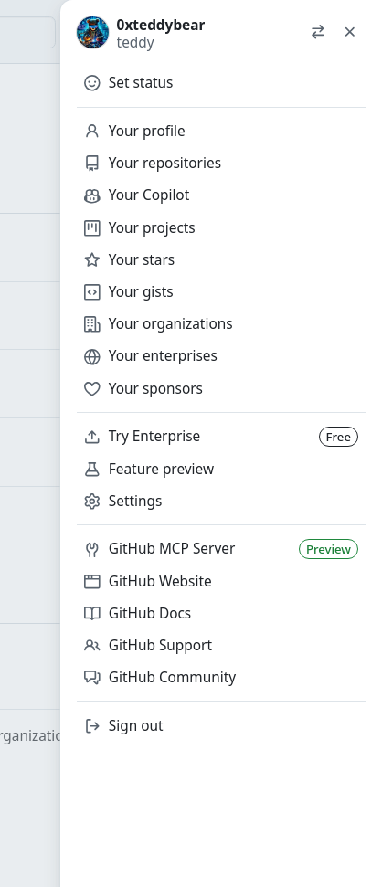

- Then, go to 'settings' on your chosen organization

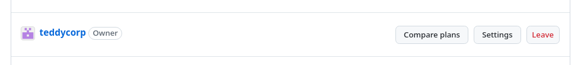

- Open the Developer Settings detail and go to 'GitHub Apps'

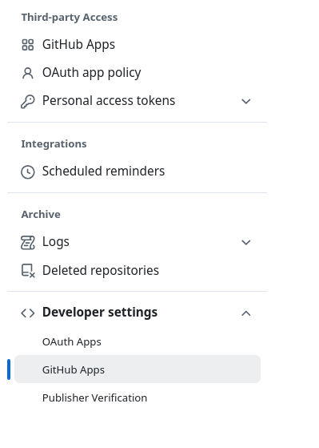

- Click on 'New GitHub App'

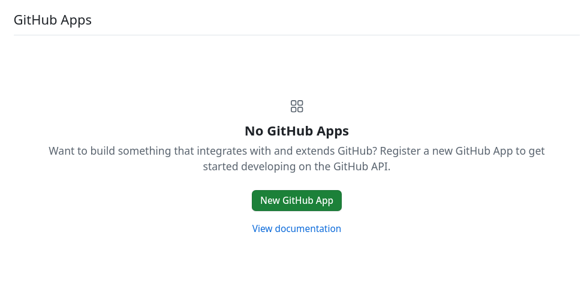

- Fill the required information.
  - The name should be unique GitHub-wide
  - Description is not necessary
  - Homepage URL can be the repo's own URL
  - There's no need to request user authorization, since the app will not be associated with users, instead performing actions on the organization directly
  - This makes 'expire user tokens' irrelevant as well

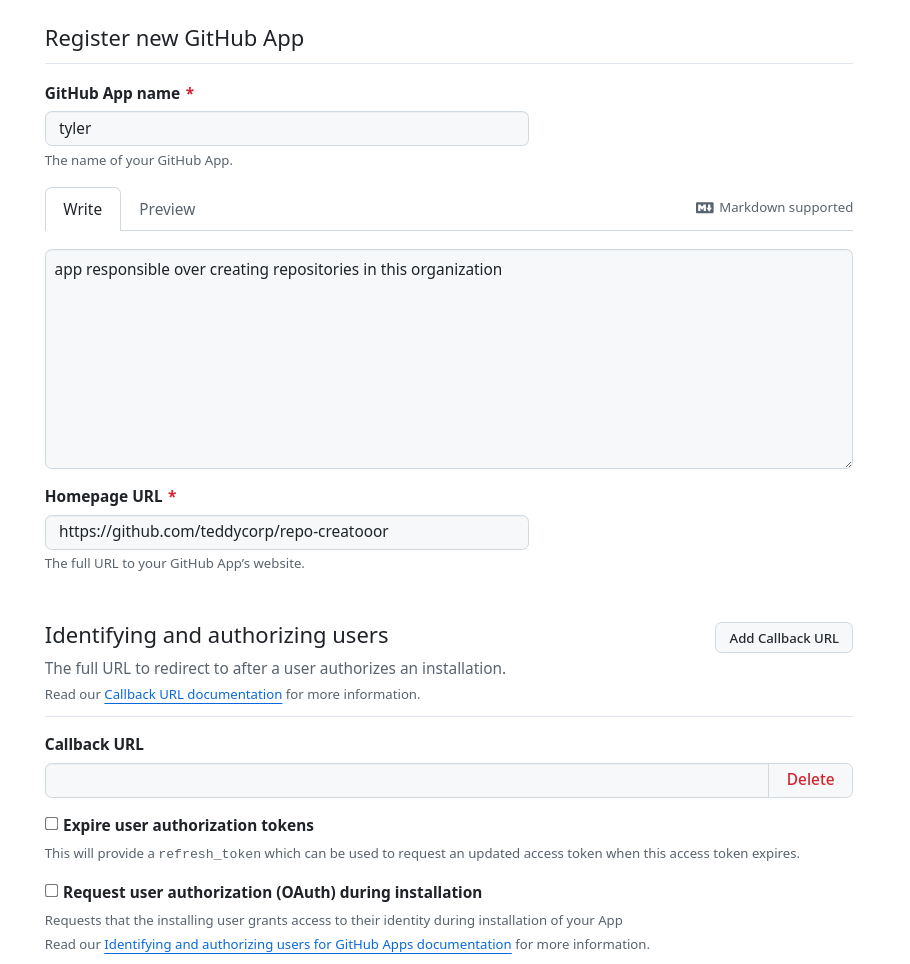

- There's no need to enable Device Flow either, nor to configure webhooks or post-installation setup

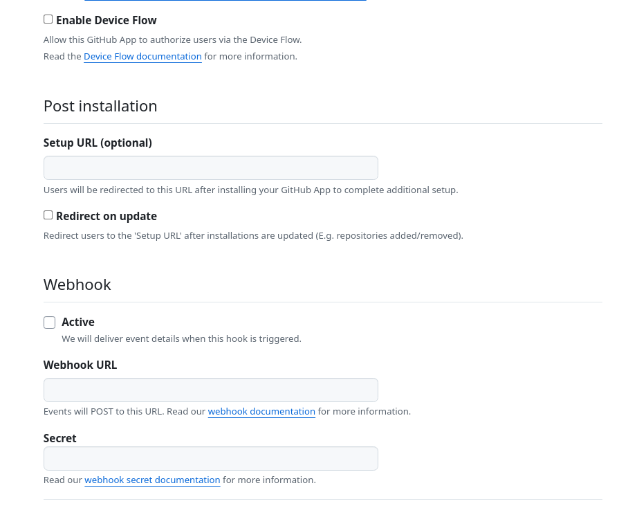

- The app will need the following permissions
  - Repository permissions
    - Administration: read and write
    - Contents: read and write
  - Organization permissions
    - Members: read-only

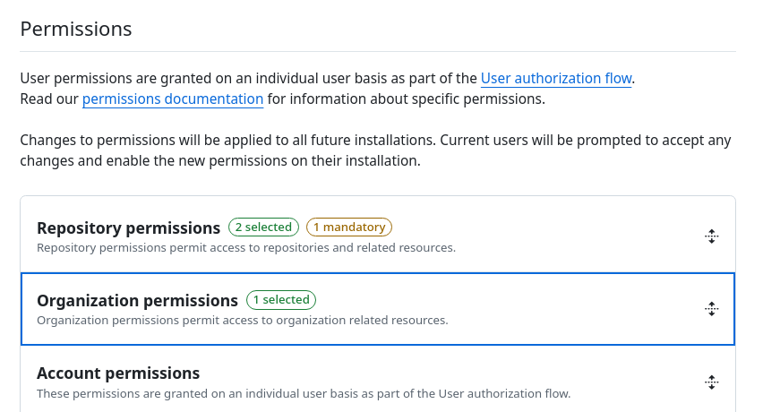

- We strongly recommend to only allow the app to be installable within your organization, as allowing other orgs to use your app could make you liable for it misbehaving, and you'd have to set your app's private key as a secret in both orgs (this is shown below)

- Afer this you'll be redirected to the app's 'About' page. From here you should: - Save the 'App ID' for future use. - Generate a private key for the app. This will be done client'side and saved as a `.pem` file in your browser's downloads. Save it for future use.
  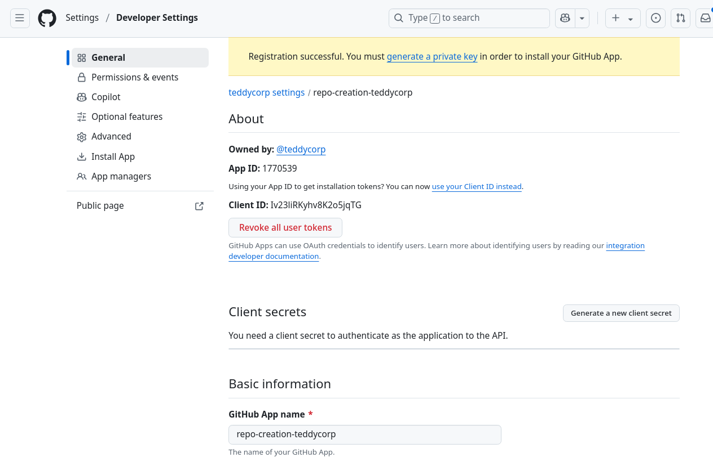

- Then, you can finally install the newly-created app in your organization!
  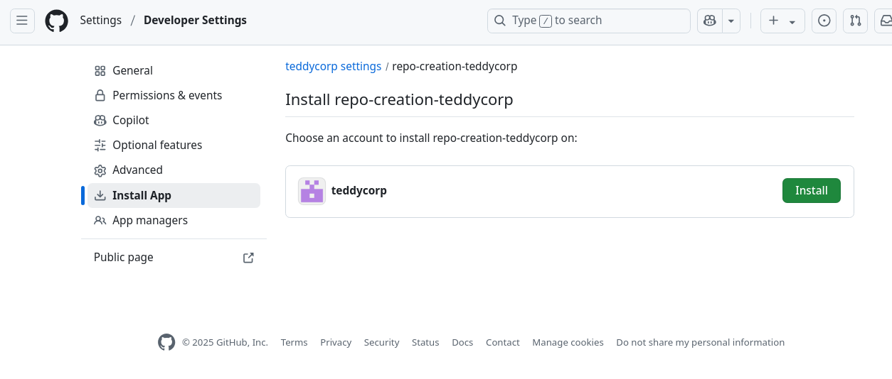

- Approve the app for all repositories.
  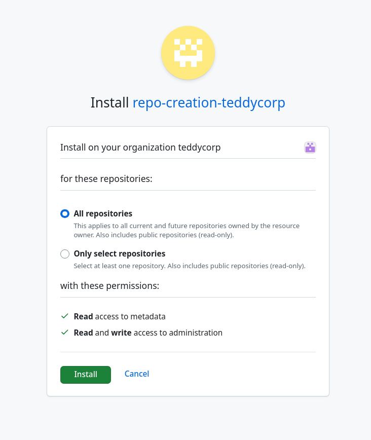

- This will leave you in the app's installation page. This page will have a url of the form `https://github.com/organizations/${org}/settings/installations/${installation_id}`. Save the installation id for later use (there's no way to retrieve this from the UI directly).
  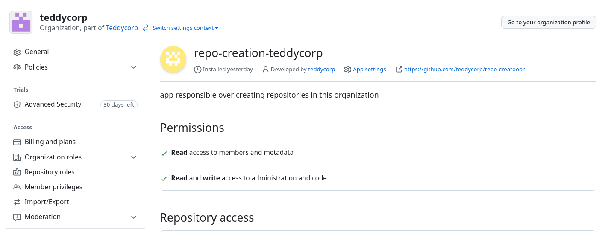

### Configuring the action

You should make the following secrets and variables avialable to the workflows, by configuring them as such in your forked repository:

#### Variables

- `GH_OWNER`:The organization repos should be created under, a.k.a the slug for your organization.
- `GH_APP_ID`: The ID for the GitHub App you just created. You can find it its 'about' section.
- `LINEAR_ORG`: The name of your linear organization, as shown in the url for e.g. an issue `https://linear.app/${linearOrg}/issue/FOO-420`. It is optional, since not all organizations use Linear for project management. Not defining it will only cause an error if you define a linear project code when creating a repository.

#### Secrets

- `DISCORD_WEBHOOK`: a discord webhook where to send notifications about created repos and the results of `repo-doctor`
- `GH_INSTALLATION_ID`: The installation id from the app's installation page's URL.
- `GH_APP_PRIVATE_KEY:` The contents of the `.pem` file downloaded after app creation.

With this, you should be able to run the `repo-creation` and `repo-doctor` workflows for your organization, as described in [the README](../README.md)

## Troubleshooting guide

- `404` error code on calling `/orgs/${owner}/teams/${team_slug}/repos/${owner}/${repo}`: your organization most likely lacks the team called `all`.
- `403` error code on calling `/repos/${org}/${repo}/branches/${branch}/protection`: your organization does not have a GitHub Teams subscription.
- `403` error code with message `Resource not accessible by integration`, when calling `/repos/${org}/${repo}/branches`: The GitHub App lacks the `Contents` Repository permissions
